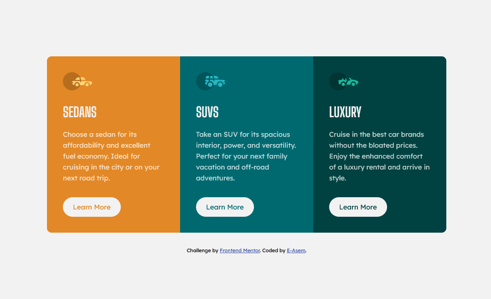

# Frontend Mentor - 3-column preview card component

This is a solution to the [3-column preview card challenge on Frontend Mentor](https://www.frontendmentor.io/challenges/3column-preview-card-component-pH92eAR2-). Frontend Mentor challenges help you improve your coding skills by building realistic projects.

## Table of contents

- [Overview](#overview)
  - [The challenge](#the-challenge)
  - [Screenshot](#screenshot)
  - [Links](#links)
- [My process](#my-process)
  - [Built with](HTML - CSS)
  - [Useful resources](#useful-resources)
- [Author](#author)
- [Acknowledgments](#acknowledgments)

## Overview

### The challenge

Users should be able to:

- See hover states for interactive elements

### Screenshot

### Links

- Solution URL: [Add solution URL here](https://your-solution-url.com)

- Live Site URL: [Add live site URL here](https://your-live-site-url.com)

## My process

### Built with

- Flexbox
- Grid
- Css variables
- Padding & Margin

### Useful resources

- [MDN Web Docs](https://developer.mozilla.org) - I really liked this pattern and will use it going forward.

## Author

- Frontend Mentor - [@E-Asem](https://www.frontendmentor.io/profile/E-Asem)